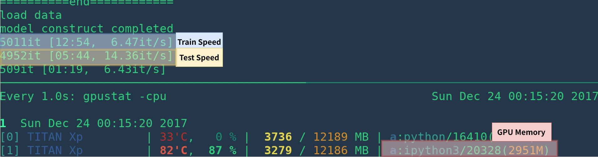
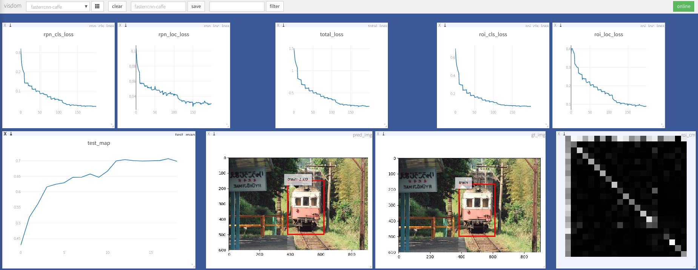
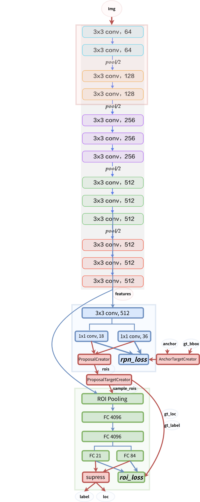

# 你之前木有见过的简单快速的Faster R-CNN实现

## 1. 引言

**[更新:]** 笔者已经用`pytorch 1.5 torchvision 0.6`简化了代码，用`torchvision`的函数替代了源代码中的`roipool`和`nms`操作. 如果老铁想阅读旧版本的代码，可以来看分支 [v1.0](https://github.com/chenyuntc/simple-faster-rcnn-pytorch/tree/v1.0)

本项目基于[chainercv](https://github.com/chainer/chainercv) 和其他[项目](#acknowledgement)实现了一个简化版的`Faster R-CNN`. 笔者希望本代码可以对那些想对`Faster R-CNN`有所了解的小白提供帮组. 本代码旨在于：

- 简化代码（*简单胜于复杂*）
- 使代码更直接（*顺序结构 [这里不太会翻译，有老铁看见帮我组织下语言] 优于嵌套*）
- 与[原论文](https://arxiv.org/abs/1506.01497)结果相匹配（*速度和`mAP`*）


同时，本代码也有以下优点:
- 本项目可以直接以Python代码执行，不再需要其他操作[这里不太会翻译，有老铁看见帮我组织下语言]
- 仅仅约2000行代码就实现了`Faster RCNN`，并且带有大量注释和说明（这多亏了`chainercv`出色的文档）
- `mAP`上取得了更好的结果（比原论文结果还nice，0.712 VS 0.699）
- 他的运行速度和其他实现相当（在`TITAN XP`上，训练为`6fps`，测试为`14fps`）
- 能够有效利用内存（使用`vgg16`大约只用3G）





## 2. Performance

### 2.1 mAP

VGG16 train on `trainval` and test on `test` split. 

**Note**: the training shows great randomness, you may need a bit of luck and more epoches of training to reach the highest mAP. However, it should be easy to surpass the lower bound. 

|              Implementation              |     mAP     |
| :--------------------------------------: | :---------: |
| [origin paper](https://arxiv.org/abs/1506.01497) |    0.699    |
|    train with caffe pretrained model     | 0.700-0.712 |
| train with torchvision pretrained model  | 0.685-0.701 |
| model converted from [chainercv](https://github.com/chainer/chainercv/tree/master/examples/faster_rcnn) (reported 0.706) |   0.7053    |

### 2.2 Speed

|              Implementation              |   GPU    | Inference | Trainining |
| :--------------------------------------: | :------: | :-------: | :--------: |
| [origin paper](https://arxiv.org/abs/1506.01497) |   K40    |   5 fps   |     NA     |
|                 This[1]                  | TITAN Xp | 14-15 fps |   6 fps    |
| [pytorch-faster-rcnn](https://github.com/ruotianluo/pytorch-faster-rcnn) | TITAN Xp | 15-17fps  |    6fps    |

[1]: make sure you install cupy correctly and only one program run on the GPU. The training speed is sensitive to your gpu status. see [troubleshooting](troubleshooting) for more info. Morever it's slow in the start of the program -- it need time to warm up.

It could be faster by removing visualization, logging, averaging loss etc.
## 3. 安装以来环境

这是一个使用`anaconda`从头开始创建环境的示例：

```sh
# create conda env
conda create --name simp python=3.7
conda activate simp
# install pytorch
conda install pytorch torchvision cudatoolkit=10.2 -c pytorch

# install other dependancy
pip install visdom scikit-image tqdm fire ipdb pprint matplotlib torchnet

# start visdom
nohup python -m visdom.server &
```

If you don't use anaconda, then:

- install PyTorch with GPU (code are GPU-only), refer to [official website](http://pytorch.org)

- install other dependencies:  `pip install visdom scikit-image tqdm fire ipdb pprint matplotlib torchnet`

- start visdom for visualization

```Bash
nohup python -m visdom.server &
```


## 4. Demo

Download pretrained model from [Google Drive](https://drive.google.com/open?id=1cQ27LIn-Rig4-Uayzy_gH5-cW-NRGVzY) or [Baidu Netdisk( passwd: scxn)](https://pan.baidu.com/s/1o87RuXW)


See [demo.ipynb](https://github.com/chenyuntc/simple-faster-rcnn-pytorch/blob/master/demo.ipynb) for more detail.

## 5. Train

### 5.1 Prepare data

#### Pascal VOC2007

1. Download the training, validation, test data and VOCdevkit

   ```Bash
   wget http://host.robots.ox.ac.uk/pascal/VOC/voc2007/VOCtrainval_06-Nov-2007.tar
   wget http://host.robots.ox.ac.uk/pascal/VOC/voc2007/VOCtest_06-Nov-2007.tar
   wget http://host.robots.ox.ac.uk/pascal/VOC/voc2007/VOCdevkit_08-Jun-2007.tar
   ```

2. Extract all of these tars into one directory named `VOCdevkit`

   ```Bash
   tar xvf VOCtrainval_06-Nov-2007.tar
   tar xvf VOCtest_06-Nov-2007.tar
   tar xvf VOCdevkit_08-Jun-2007.tar
   ```

3. It should have this basic structure

   ```Bash
   $VOCdevkit/                           # development kit
   $VOCdevkit/VOCcode/                   # VOC utility code
   $VOCdevkit/VOC2007                    # image sets, annotations, etc.
   # ... and several other directories ...
   ```

4. modify `voc_data_dir` cfg item in `utils/config.py`, or pass it to program using argument like `--voc-data-dir=/path/to/VOCdevkit/VOC2007/` .


### 5.2 [Optional]Prepare caffe-pretrained vgg16

If you want to use caffe-pretrain model as initial weight, you can run below to get vgg16 weights converted from caffe, which is the same as the origin paper use.

````Bash
python misc/convert_caffe_pretrain.py
````

This scripts would download pretrained model and converted it to the format compatible with torchvision. If you are in China and can not download the pretrain model, you may refer to [this issue](https://github.com/chenyuntc/simple-faster-rcnn-pytorch/issues/63)

Then you could specify where caffe-pretraind model `vgg16_caffe.pth` stored in `utils/config.py` by setting `caffe_pretrain_path`. The default path is ok.

If you want to use pretrained model from torchvision, you may skip this step.

**NOTE**, caffe pretrained model has shown slight better performance.

**NOTE**: caffe model require images in BGR 0-255, while torchvision model requires images in RGB and 0-1. See `data/dataset.py`for more detail. 

### 5.3 begin training


```bash
python train.py train --env='fasterrcnn' --plot-every=100
```

you may refer to `utils/config.py` for more argument.

Some Key arguments:

- `--caffe-pretrain=False`: use pretrain model from caffe or torchvision (Default: torchvison)
- `--plot-every=n`: visualize prediction, loss etc every `n` batches.
- `--env`: visdom env for visualization
- `--voc_data_dir`: where the VOC data stored
- `--use-drop`: use dropout in RoI head, default False
- `--use-Adam`: use Adam instead of SGD, default SGD. (You need set a very low `lr` for Adam)
- `--load-path`: pretrained model path, default `None`, if it's specified, it would be loaded.

you may open browser, visit `http://<ip>:8097` and see the visualization of training procedure as below:




## 问题解决

- dataloader: `received 0 items of ancdata` 

  可以查看这个[discussion](https://github.com/pytorch/pytorch/issues/973#issuecomment-346405667)，不过他已经被在 [train.py](https://github.com/chenyuntc/simple-faster-rcnn-pytorch/blob/master/train.py#L17-L22) 中修改了，所以我觉得你可能遇不到这个问题了
  
- 关于 Windows上支持

  由于笔者没有有GPU的windows系统去debug和测试这份代码. 所以如果有人可以帮助我在windows上测试和PR，那将是十分受欢迎的！！


## Acknowledgement
这个项目建立在很多十分nice的项目之上，包括：

- [Yusuke Niitani's ChainerCV](https://github.com/chainer/chainercv) (主要)
- [Ruotian Luo's pytorch-faster-rcnn](https://github.com/ruotianluo/pytorch-faster-rcnn) which based on [Xinlei Chen's tf-faster-rcnn](https://github.com/endernewton/tf-faster-rcnn)
- [faster-rcnn.pytorch by Jianwei Yang and Jiasen Lu](https://github.com/jwyang/faster-rcnn.pytorch).It mainly refer to [longcw's faster_rcnn_pytorch](https://github.com/longcw/faster_rcnn_pytorch)
- 所有以上的项目都直接或间接参考了项目 [py-faster-rcnn by Ross Girshick and Sean Bell](https://github.com/rbgirshick/py-faster-rcnn)


## ^_^
本项目为MIT协议，查看LICENSE以获取更多细节！

十分欢迎 Contribution !

如果老哥遇到什么任何问题，可随时开一个issue，但是最近有些忙可能回复晚一些嘿嘿

如果我有哪里错了或者说的不清楚，还请不吝赐教！

介是模型架构图：
